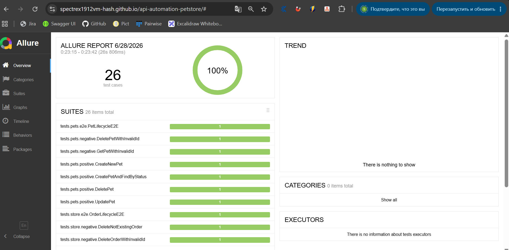
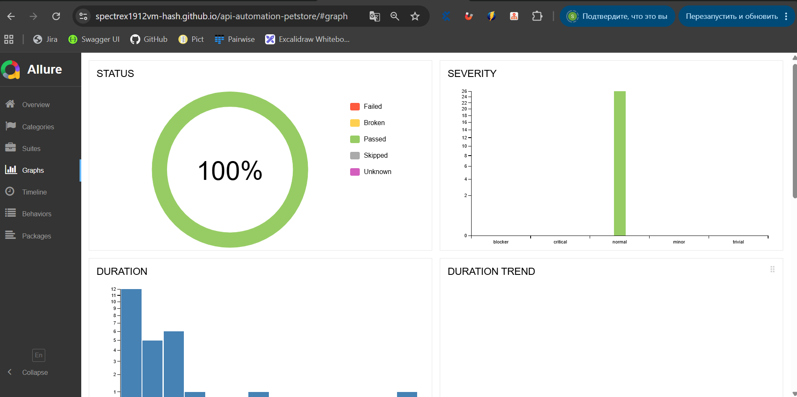
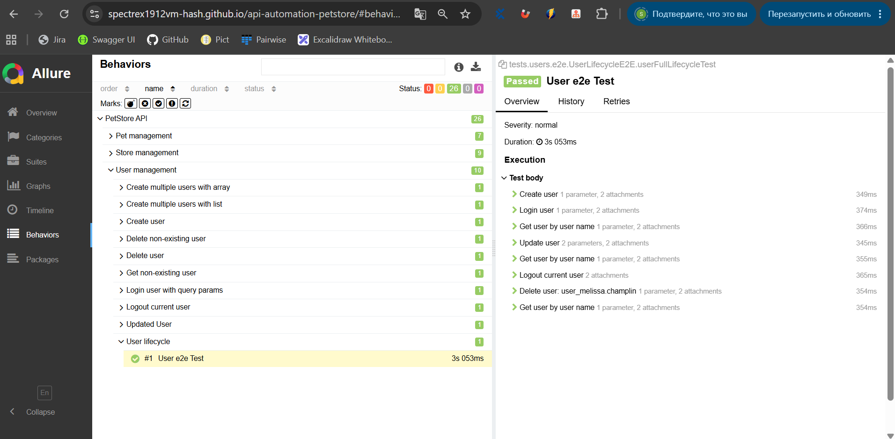

# PetStore API Automation Framework


Фреймворк автоматизированного тестирования **Swagger PetStore REST API**, построенный на Java с использованием современных практик QA Automation.

---

##  Возможности проекта

* ✅ REST API тестирование
* ✅ Positive / Negative / End-to-End сценарии
* ✅ REST Assured Specifications
* ✅ Factory Pattern
* ✅ DTO модели (Lombok)
* ✅ Java Faker для генерации тестовых данных
* ✅ Allure Report
* ✅ GitHub Actions (CI)
* ✅ Автоматическая публикация Allure Report через GitHub Pages

---

# 📊 Онлайн-отчет

### 🔗 Актуальный Allure Report

https://spectrex1912vm-hash.github.io/api-automation-petstore/

---

## Обзор выполнения тестов



---

## Статистика выполнения



---

## Пример End-to-End сценария

Пример полного жизненного цикла заказа с автоматически сформированными шагами выполнения.



---

#  Описание проекта

Данный проект демонстрирует построение масштабируемого фреймворка автоматизации API-тестирования с использованием современных инструментов Java Automation.

Основной целью проекта является разработка чистой архитектуры тестового фреймворка, позволяющей легко расширять покрытие API, переиспользовать компоненты и поддерживать проект по мере роста количества тестов.

Фреймворк реализован с разделением ответственности между слоями и использованием переиспользуемых компонентов.

---

#  Используемые технологии

* Java 17
* REST Assured
* JUnit 5
* Gradle
* Lombok
* Java Faker
* Allure Report
* GitHub Actions
* GitHub Pages

---

#  Архитектура проекта

Проект построен по принципу разделения ответственности.

```text
src/test/java
│
├── factories
├── models
├── specs
├── steps
└── tests
    ├── positive
    ├── negative
    └── e2e
```

### Основные компоненты

### Specs

Переиспользуемые Request/Response Specification для REST Assured.

### Models (DTO)

Java-модели для сериализации и десериализации JSON.

### Factories

Генерация тестовых данных с использованием Java Faker.

### Steps

Переиспользуемые действия над API.

### Tests

Тесты разделены по типам сценариев:

* Positive
* Negative
* End-to-End

---

#  Покрытие API

## User API

* Create User
* Get User
* Update User
* Delete User
* Login
* Logout
* Create Users (Array/List)
* Negative Scenarios
* End-to-End Lifecycle

---

## Pet API

* Create Pet
* Get Pet
* Update Pet
* Delete Pet
* Find Pet By Status
* Negative Scenarios
* End-to-End Lifecycle

---

## Store API

* Place Order
* Get Order
* Delete Order
* Inventory
* Negative Scenarios
* End-to-End Lifecycle

---

# ▶ Запуск проекта

Запуск всех тестов

```bash
./gradlew clean test
```

Запуск отдельного теста

```bash
./gradlew test --tests "package.ClassName"
```

---

#  Отчеты

После каждого Push или Pull Request GitHub Actions автоматически:

* собирает проект;
* запускает тесты;
* формирует Allure Report;
* публикует отчет через GitHub Pages.

Последняя опубликованная версия отчета всегда доступна по ссылке:

https://spectrex1912vm-hash.github.io/api-automation-petstore/

---

#  CI/CD

Pipeline GitHub Actions включает:

* Checkout репозитория
* Установку JDK
* Сборку проекта
* Запуск полного набора тестов
* Генерацию Allure Report
* Автоматическую публикацию отчета на GitHub Pages

---

#  Ключевые особенности

* Масштабируемая архитектура
* REST Assured Specifications
* Factory Pattern
* DTO модели
* Java Faker
* Позитивные сценарии
* Негативные сценарии
* End-to-End тестирование
* Allure Reporting
* GitHub Actions CI
* GitHub Pages Deployment
* Чистая структура проекта


